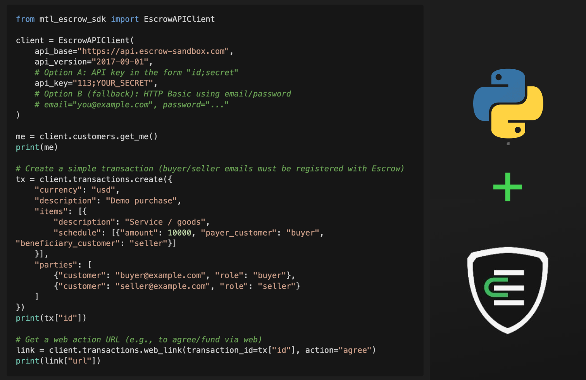

# MTL Escrow Python SDK

**Unofficial**, lightweight Python SDK for the [Escrow.com API](https://www.escrow.com/api/docs/reference)

> ⚠️ This is a minimal client intended for prototyping.  
> Verify auth & payloads with your Escrow.com account/docs before using in production.



---

## 🧩 Install

```bash
pip install mtl-escrow-python-sdk
# or from source
poetry add mtl-escrow-python-sdk
```

---

## 🛠️ Development

```bash
poetry install
poetry run black .
poetry run autopep8 --in-place --recursive .
poetry run flake8
poetry run pytest -v
```

---

## 🚀 Quickstart

### Running the Example

1. **Install dependencies:**

   ```bash
   poetry install
   ```

2. **Set up environment variables:**
   Create a `.env` file in the project root:

   ```bash
   echo "ESCROW_API_KEY=your_api_key_here" > .env
   echo "ESCROW_EMAIL=your_email@example.com" >> .env
   ```

   Replace `your_api_key_here` with your actual Escrow.com API key and `your_email@example.com` with your Escrow.com email address.

3. **Run the example:**

   ```bash
   poetry run python examples/demo.py
   ```

## 🔐 Auth

- **Preferred** → API Key with HTTP Basic — pass `email` & `api_key` to use HTTP Basic authentication with email as username and API key as password.

- **Fallback** → HTTP Basic — pass `email` & `password` to send standard Basic auth.

- You can also inject a pre-configured `httpx.Auth` via the `auth=` parameter.

---

## ⚙️ Features (MVP)

- **Customers** → get self/any, list API keys  
- **Transactions** → create/get/list, perform simple actions, payment link (credit card / PayPal / wire), web action link  
- **Webhooks** → verify signature helper (HMAC-SHA256; adjust to your setup)

---

## 🧠 Notes

- Endpoints follow Escrow.com API v2017-09-01 (`/2017-09-01/transaction`, etc.).  
- This SDK focuses on simplicity and clarity — PRs are welcome for more endpoints!

---

## 📚 Learn More

- [Escrow.com API Basics](https://www.escrow.com/api/docs/basics)
- [Escrow.com API Reference](https://www.escrow.com/api/docs/reference)
- [MusicTech Lab](https://musictechlab.com)

---

## 🪪 License

MIT License — © 2025 **MusicTech Lab**  
Built with ❤️ by MusicTech Lab.
